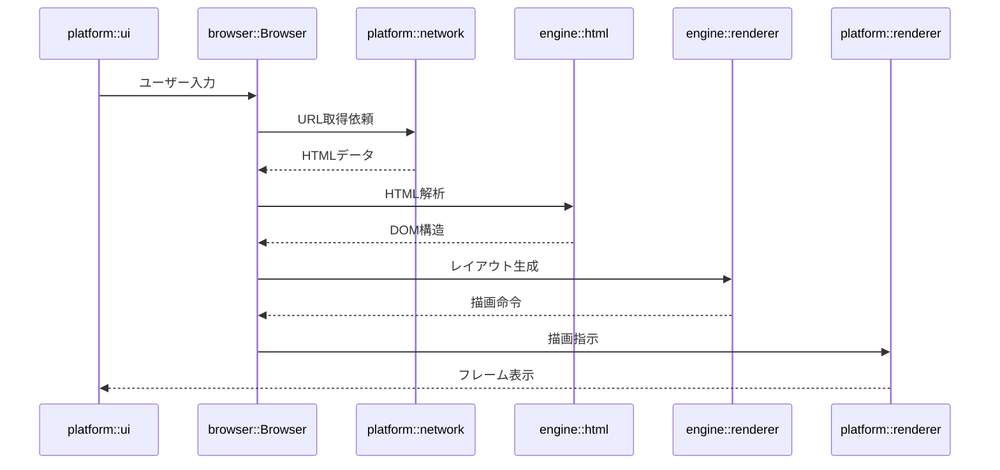

# Orinium Browser Architecture

## 1. 全体構成
```
User Input
   │
   ▼
platform::ui (App)
   │ event
   ▼
browser::Browser
   │ fetch(url)
   ▼
platform::network::NetworkCore
   │ HTML bytes
   ▼
engine::html::parser
   │ DOM Tree
   ▼
engine::renderer
   │ Vec<DrawCommand>
   ▼
platform::renderer
   │ GPU submission
   ▼
Window Frame
```

## 2. 各レイヤの責務
| レイヤ                    | 主なモジュール                            | 役割                                      |
|------------------------|------------------------------------|-----------------------------------------|
| **Application**        | `examples/tests.rs`, `main.rs`     | テストや起動処理、CLIエントリポイント。                   |
| **browser**            | `src/browser/mod.rs`               | 全体を統合するオーケストレーション層。アプリ起動・初期化制御。         |
| **platform::ui**       | `src/platform/ui`                  | OSウィンドウとイベントループ (`winit`) の管理。アプリの「外側」。 |
| **platform::renderer** | `src/platform/renderer`            | GPU抽象（`wgpu`ベース）。描画命令の実行、フレーム管理。        |
| **engine::renderer**   | `src/engine/renderer`              | HTML/CSSレイアウト結果から描画命令を生成する論理描画層。        |
| **engine::html / css** | `src/engine/html`・`src/engine/css` | トークナイズ、パース、DOM/CSSOM構築。                 |
| **platform::network**  | `src/platform/network`             | TCP/TLS通信、HTTP処理、キャッシュ、Cookie管理。        |
| **platform::io**       | `src/platform/io`                  | OS依存の入出力抽象。ファイル・設定管理など。                 |

## 3. 簡単な実行フロー


## 4. 依存方向と逆転依存
* モジュールの依存は **上位 → 下位** の一方向のみ
* 下位層は上位層を参照しない
* 逆転依存は循環依存を生むため避ける

### 依存方向図

```
┌───────────────┐
│    browser    │
└───────┬───────┘
        ▼
┌───────────────┐
│ engine        │
│ renderer/html │
└───────┬───────┘
        ▼
┌───────────────┐
│ platform      │
│ renderer/ui   │
└───────────────┘
```
* 矢印は依存方向を示す
* 上位層が下位層を呼ぶ一方向のみ

<!--
イベントは上位層から下位層へ伝播し、下位層に上位を参照させず、必要な場合は Callback / Channel を利用
--> 
